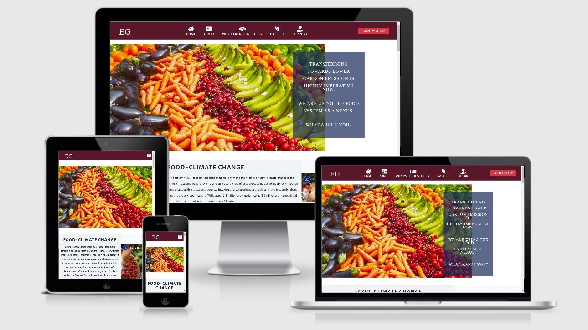

# **EG** 

### **Website link:** 

*my github link*: [Rozdandy](https://github.com/Rozdandy?tab=repositories)

[EG](https://rozdandy.github.io/myfirst-miletone-project/)
Essence Greenery advocate for food production, and agricultural practices in a sustainable way using climate change as a focal point and taking its concept and mandate from the sustainable development goals. The project is mainly the developer's idea which is based on farm project in Nigeria. One of the primary objectives of building the website is to attract foreigners to partner or invest with us to tackle food insecurity and malnutrition in the future while transitioning to lower-carbon emission economies. The site is for an educational purpose though a B2B2C. In the future, the sites hope to have a platform that will enable any person to do online shopping of all major food groceries and will be delivered within 30 minutes across his/her neighborhoods” a neighborhood online food platform”.

# **UX**

The website is to advocate and show how the food systems could be used to make food available to people without harming the environment. The website is to attract investors especially those abroad, educational institutions who are interested in the food system and climate change to partner with us to fight food insecurity and climate change. The user also can view what have been done. We think an online presence will attract our likes and those who want to invest in Africa.

# **Wireframe**

The prototype of this website was firstly drafted on piece of papers to have a rough idea of what I was building.The knowledge wass later transferred to build my mockup using Balsamiq App. Wireframe for large device was first created and sent to my mentor. After review and discussion with my mentor he suggested I build a all-in-one page website, that is, all the five pages would be in one page so that users do not have to keep moving from one page to another that slow loading time and also for easy debugging when there is a bug.
After some days to modify the wireframe for moble device, the Balsamiq App had stopped working. Every attempt to get it work by using the license code given by Code Institute were effortless. To avoid slippage of of time, I was advised to submit without the mobile design.
Therefore, I attached the previous wireframe that I sent to my mentor which does not contain the final modification that I made. Also, attached was the mapping out of each section for the mobile design using MS. Word. This serves as a guide when I was creating the sites.
Lastly, I also attached the screenshot of the Balsamiq App that stopped working.

**Desktop View**
 * [Wireframe](wireframe/desktopdesign.pdf)
        

**Mobile Design** 
 * [Mobile Wireframe](wireframe/mobileWireframe.pdf)

### User stories

Users may want to know the role of the food system to mitigate climate change. The reason why we should revolutionize farming in Africa, also, foreign research institutes that may want to partner with us and want to conduct research or test new seeds in the African soil and the farming system in Nigeria.
 
**Specifically, they may want to:**
 
* As a visiting user, I want to be able to know how climate change may impact the food system.
* As a visiting user, I would want to know the meaning of the logo "EG".
* As a visiting user, I would want to know how to register with EG.
* As a visiting user, I would want to see video of or world view on climate change and the food system.
* As a visiting user, I would want to know how MDG and SGD are addressing climate change issues.
* As a potential client, I would want to know the core strength of EG.  
* As a potential client, I would want to know the core mandate of EG. 
* As a visiting user, I would want to know more about EG.
* As a visiting user, I would want to know why I should partner with EG.
* As a visiting user, I would want to know how I could partner with EG.
* As a potential investor, I would want know where this organisation is located.
* As a potential customer, I would want to see some of photos as proof of what they have started and what they are doing.
* As a potential donor, I would want  to know why I should donate or give materially or financially.
* As a visiting user, I would want to know how to contact the management.
* The management would want to be able to contact potential investors.
* As a management, I want to provide my social media links so that users can follow my updates.
* As the management, I would want to be contacted by potential donors.

### Design

#### **Colour Scheme**

The developer used [eggradients](https://www.eggradients.com/shades-of-green-color) to choose colors that were used in creating the website. Particularly, 5 colors were used and they signify what the sites stands for.
  * RGBA(0,73,83,0.9): this is a shade of green-blue which is very important in agriculture, it also signifies sustainable development whereby in the process of development you do not impact the environment negatively.
  * #ffffff: it signify purity and pristine.
  * RGBA(255,36,0, 0.8): It is a shade of red for cheerfulness, energy, and enthusiasm for the future and hope those for that need support.
  * #003d52: this is a shade of blue, it signifies the sky, climate change, the water, and the color used in the 17TH SDG.
  * #5a172a: A shade of brown which signifies the earth (brown soil).

 #### **Typography**

 * Font: [Google Fonts!](https://fonts.google.com/) The two main fonts used in this project came from Google Fonts. Developer use "Roboto", sans-serif for the paragraphs and 'Merriweather Sans', sans-serif; for the headers.

* **Stack Overflow**: [Stack Overflow](https://fontawesome.com/)	Developer used the websites to check for proper syntax while creating the project.

# **Features:**

The site has the following features:

## **1. The header:**

*The header has the following features*
 
1. The company logo **EG**
2. The **CONTACT US** red button
3. The navigation bar: It housed all the links and icons of the site. It has the following:

     i. *Home link and icon*
    ii. *About link and icon* 
   iii. *Why partner with us*
    iv. *Gallery link and icon* 
     v. *Support link and icon* 

## **2. EG**
The company logo **EG**: When a user hover the mouse over it, it displays the fullname of the organisation, also when a user click on it, it revert back to the home page.

## 3. Home Page 

This the first and main page of the site when a user click the URL. The page educates on the existence of climate change and the action of the international community such as COP 21 in acknowledgement of climate change. 
**Specifically it has the following features**:

    *   A carousel or slider.
    *   An overlay text on the carousel.
    *   A text section that inform about climate change impact.
    *   A video on climate change with respect to the food system.
    *   Sustainable mandate section that has 6 images which also act as links on sustainable goals and development.

## 4. About 
This section gives an overview of what the organization stands for. 

**It has the following features**:

   * **About us**: It describes What EG is all about and what we do.
   * Image
   * Mission: It explains the direction and what the comapny intend to achieve.
   * Visions: it discusses the future aspirations of the organisation.

## 5. Why partner with us?
This section discusses the various reasons why it is necessary to partner with us at EG.

**It has the follwoing features**:

   * The Need For Partnership: This section provides texts information on why it is imperative to partner with us.
   * Image of forming bond of partnership.
   * Why Partnership?: It discusses about those who we may want to partner with and why they should partner with us.
   * How?: It discusses how the organisation intended to achieve its feats.

## 6. Gallery
This feature shows some of the previous works at the farm and part of our harvests.

**It has the following features**:

      * A carousel or slider: This slider displays 5 images 
      * Image 1: It is image of freshly harvested corn.
      * Image 2: It is image of freshly harvested yam.
      * Image 3: It is image of harvested dry corn.
      * Image 4: It is image of freshly harvested watermelon.
      * Image 5: It is image of farm workers.

## 7. Support 
It explained why fingers are not equal, why some need help than the others, it appeal for the support of the less previledge. 

**Specifically, it has the following features**:

   * Image with overlay text
   * Support Our Mission: The section appeals for help and donation either materially or financially.
   * Video: This video explains the number of people that goes daily without food and the need of urgent help.

## **8. Footer:** 
This section is located at the bottom-most part of the page. It provides the user with the following information.
   * Contact information 
   * Location 
   * Email address 
   * Social media links
   * Our core strength

### **In the future:**

* Our **Activities** feature will be include and also the online shopping links will be included. This link would connect every neighborhood in the country to the nearest grocery shops for quick accessibility of products that will be delivered within 30 minutes after complete payment.
* The icons in the navigation would open in another page.
* More call-to-action buttons, such as online live chat with customers.
* the Social media such as the facebook, instagram, twitter, linkedin will open link Essence Greenery instead of developer personal account. 

# **Technology Used**

*The follwoing Technologies, Frameworks, and Libraries that were used to write the project.*

* **HTML**: HTML/HTML5 the language used to create the form and add content to the website
* **CSS**: It provides the styling for the website.
* **Git**: It was used for version control which uses the Gitpod terminal to commit to Git and Push codes to GitHub
* **GitHub**:         [GitHub](https://github.com/) Developer used GitHub as a project repository to save, and as a hosting service to live site.
* **Gitpod**: The project used the Gitpod IDE as my workpsce to develop the website.
* **Icons**:          [Font Awesome](https://fontawesome.com/) Social Media Icons were taken from this site.
* **JQuery**:         [BootStrap](https://getbootstrap.com/docs/4.5/getting-started/introduction/) Developer embedded JQuery from Bootstrap.
* **Javascript**:     [BootStrap](https://getbootstrap.com/docs/4.5/getting-started/introduction/) Developer used Bootstrap for the Navbar, Grids, Carousel and modal form included in this project.
* **CSS validator**:  [CSS validator](https://jigsaw.w3.org/css-validator/) The site was used to test for the validity of my CSS code. 
* **HTML validator**: [HTML validator](https://validator.w3.org/) The site was used to test for the validity of my HTML code.
* **Hover.css**:      [Hover.css](https://ianlunn.github.io/Hover/) The site was used on the navigation bar links and Social Media icons in the footer to create an hovering effects.
* **Balsamiq**:       [Balsamiq](https://balsamiq.com/) The site was used to create the wireframes during the design stage of the project.
* **freeformatter**:  [freeformatter](https://www.freeformatter.com/html-formatter.html) The site was used to format HTML.

# Testing

***Sites Validation***

I used the following webistes to validate both my HTML and CSS files respectively.

* [HTML-Validator](https://validator.w3.org/#validate_by_input "HTML-Validator")
* [CSS-validator](https://jigsaw.w3.org/css-validator/#validate_by_input "CSS-validator")

    * The HTML validated the codes without any errors.
        [HTML test](assets/testing/htmlvalTest.jpg) 
    * Similarly, the CSS validator checked the Cascading Style Sheets (CSS), and nd it is without errors.
        [CSS test](assets/testing/cssvalTest.jpg)
    * Also, I used the 'Audit' option in Google Dev Tools to ensure the site is working perfectly.
    * Furthermore, the website was tested on Google Chrome, Mozilla, Firefox, and Internet Explorer.
      and it works perfectly in them.
    

# **Testing user stories from UX section**

* As a visiting user, I want to know how climate change may impact the food system.

                1. From the HOME PAGE.
                2. User scrolls down just below the carousel slider.
                3. There is the article on FOOD-CLIMATE. 
                4. Users can watch the world view, on climate change and food systems on the YouTube video 
                   embedded at the right corner of the article.

* As a visiting user, I would want to know the meaning of the logo "EG".

                1. A user at the home page will see the logo at left corner of the header.
                2. When he/ she hovers their cursor on the logo, it will display Essence Greenery.
                3. EG is the acronym for Essence Greenery.

* As a visiting user, I would want to know how to register with EG.

                1. When the customer arrives on the webpage, he/she can see the navigation bar with several 
                   links.
                2. Within the navigation link, they can click on the "contact us" and it will open the modal 
                   form.
                3. The customer can fill the form and submit it. 

* As a visiting user, I would want to see video of or world view on climate change and the food system.

                1. When the customer arives on the webpage, he/she can see the navigation bar with several 
                   links.
                2. Within the navigation link, they click on the Home link and it will scroll to the page.
                3. The video is just by the right corner of the FOO-CLIMATE TEXT. They can click and watch. 

* As a visiting user, I would want to know how MDG and SGD are addressing climate change issues.

                1. At the homepage, he/she can see the navigation bar with several links.
                2. Within the navigation link, they click on the Home link and it will scroll 
                   to the page.
                3. Within the Home page is Our Sustainable Mandate section.
                4. There he/ she can click the images to link them to required information.

* As a potential client, I would want to know the core strength of EG. 

                1. When the user arrives on the webpage, the user he/ she can scroll down to the footer 
                   section.
                2. Our core strenght information is there at the footer.
            

* As a potential client, I would want to know the core mandate of EG. 

                1. At the homepage, he/she can see the navigation bar with several links.
                2. Within the navigation link, they click on the Home link and it will scroll to the page.
                3. Within the Home page is Our Sustainable Mandate section.
                4. There he/ she can click the images to link them to required information.
                5. Our mandate is base on 1st, 2nd, 3rd, 8th, 13th, and 17th of the Sustainable Development 
                   Goals.

* As a visiting user, I would want to know more about EG.

                1. When the user arrives on the webpage, the user he/ she can see the navigation bar with 
                   several links.
                2. On the navigation they can click the About link or icon.
                3. The link will scroll down swiftly, and there they can read more information about EG.
                4. The section also contain the MISSION and VISON of the organization.

* As a visiting user, I would want to know why I should partner with EG.

                1. At the homepage, he/she can see the navigation bar with several links.
                2. On the navigation they can click the WHY PARTNER WITH US link or icon
                3. The section will scroll down swiftly to Why Partner and HOW section. Right there, 
                   the informations is available.
                

* As a visiting user, I would want to know how I could partner with EG.

                1. When the user arrives on the webpage, the user, he/ she can see the navigation 
                   bar with several links
                2. On the navigation bar they can click on the WHY PARTNER WITH US link or icon
                3. The section will scroll down swiftly.
                4. The user can click on the CONTACT US form at the Navigation bar to register with us.
                5. They fill their information on the placeholders.
                6. When done, they can click the blue button below to submit.

* As a potential investor, I would want to know where this organisation is located.

                1. When the user arrives on the webpage, the user he/ she can scroll down to the 
                    footer section.
                2. A user just scrolls down to the footer. It is right there.
                3. The full address of the organisation is located at the footer.

* As a potential customer, I would want to see some of photos as proof of what they have started and what they are doing.

                1. When the user arrives on the webpage, the user he/ she can scroll down to the footer 
                   section.
                2. On the navigation they can click the GALLERY link or icon
                3. The section will scroll down swiftly, right there are various image from EG.

* As a potential donor, I would want  to know why I should donate or give materially or financially.

                1. A potential donor at the home page will see the Navigation bar
                2. On the navigation they can click the SUPPORT link or icon
                3. The section will scroll down swiftly to support our mission.
                4. Also, available there is a supporting video to view.

* As a visiting user, I would want to know how contact the management.

                1. When the customer arrives on the webpage, he/she can see the navigation bar with several
                   links.
                2. The user can either choose to contact us using the CONTACT US form at the navigation bar.
                3. The customer can fill the form and submit it.
                4. Also, a user can just scroll down to the footer. Right there is our Phone, Email and 
                   Locations.
 

* The management would want to be able to contact potential investors.
               
                1. When a customer arrives on the webpage, he/she can see the navigation bar with several
                   links.
                2. The user can fill their data on the CONTACT US form at the navigation bar and submit.
                3. The management can reach potential clients through their information submitted with the 
                   contact us form.
    

* As the management, I want to provide my social media links so that users can follow my updates 
                
                1. When the user arrives on the webpage, the user can scroll down to the footer section.
                2. In the footer section the user will see the social media links for the business.

* As the management, I want to be contatcted by potential donors.

                1. When the customer arrives on the webpage, he/she can see the navigation bar with several 
                   links.
                2. The user can either choose to contact us using the CONTACT US form at the navigation bar.
                3. The customer can fill the form and submit it.
                4. Also, a user can just scroll down to the footer. Right there is our Phone, Email and 
                   Locations.

### **Manual Testing**

#####  Home Page:

1. Navigation bar 

              1. At the Home Page on desktop. 
              2. Inspect links, and icons in the navigation menu to ensure they are well placed and they  
                 are appearing correctly and centrally aligned on the navigation bar.
              3. Notice that the navbar is fixed so no matter where you are on the site you know where you are,
                 one can click to access any any section.
              4. Move your cursor over the logo "EG" to display the full name of the organiaztion, that is, 
                 Essence Greenery.
              5. Move the cursor over the icons to ensure they hovers and displaying the expected red color.
              6. Resize the screen to mobile view to ensure that the navigation bar is responsive and all 
                 the icons and links collapsed into the toggler icon. 
              7. To test the smooth scroll and also to verify that the links are working do the following:

                    (i)   Click on "HOME" link and verify that it stays on the HOME page
                    (ii)  Click on "ABOUT" link and verify that it scrolls smoothly to the ABOUT section.
                    (iii) Click on "WHY PARTNER WITH US?" and verify that it scrolls smoothly to the 
                          WHY PARTNER WITH US? section.
                    (iv)  Click on "GALLERY" link and verify that it scrolls smoothly to the GALLERY section.
                    (v)   Click on "SUPPORT" link and verify that it scrolls smoothly to the SUPPORT section.
                    (vi)  Click on "CONTACT US" link and verify that form open.

                    **On the mobile view and medium device view**

                    (a) Check to ensure that the navigation bar is responsive and all the icons and links collapsed 
                        into the toggler icon.
                    (b) Notice that the toggler icon is properly styled and at the right corner position.
                    (c) Notice that all the icons are hidden, and that only the names of the links that appears 
                        and they are centrally and vertically aligned.
                    (d) Repeat steps (i) - (v) above for the mobile views
                    (e) Check the overlay text in the home page carousel, ensure the overlay text is hidden for 
                        the mobile device and medium device.
                    (f) Notice that all the various sections are vertically align for the mobile view.

2. **About section**

              1. Scroll down to the ABOUT section or click on the icon at the navigation bar on a desktop view. 
              2. The ABOUT heading is bold and centrally aligned in the 2/3 container with a background color 
                 of #05041a.
              3. Notice the innovative image occupies 1/3 of the whole section.
              4. Notice that the headings are properly placed within their columns and they are centrally aligned.
              5. Check that the sub-heading that it is capitalize is properly placed.
              6. Ensured that the text are legible and centrally align. 
              7. Check the Mission and Vision section texts that they italics and centrally align.
              8. Repeat this same steps on a mobile view.
              9. Also, inspect that all the various sections are vertically align for the mobile view and they 
                 are responsives.

3. **Why partner with us?**

              1. Scroll down to the Why partner with us? section or click on the Why partner with us? link in the 
                 navigation bar on a desktop view.
              2. check the about heading is bold, centrally alligned and it is in uppercase in the container
              3. Check that the sub-heading that it is capitalize is properly placed.
              4. Insepct the section that it occupies 2/3 container of the whole section with a background 
                 color of #05041a.
              5. Ensured that the text are legible and centrally align. 
              6. Notice the partnership image occupies 1/3 of the whole section.
              7. Check the How section texts that they italics and centrally align.
              8. Repeat this same steps on a mobile view.
              9. Also, inspect that all the various sections are vertically align for the mobile view and they 
                 are responsives.

4. **Gallery section** 

              1. Scroll down to the GALLERY section or click on the icon at the navigation bar on a desktop view.
              2. Inspect that the carousel is sliding perfectly.
              3. Check the slider that their are five images
              4. Check the slider indicators that are working and the previous and next button are
                 functioning
              5. Repeat this same steps on a mobile view

5. **The Support section** 

              1. Click on the icon at the navigation bar on the desktop view or manually scroll down 
                 to section.
              2. Check the Support heading is bold, uppercase and centrally aligned in the 2/3 container 
                 with a background color of red;
              3. Check that the sub-heading is also in uppercase and it is properly placed.
              4. Ensure that text are legible, italics and white.
              5. Ensured that the text are legible and centrally align. 
              6. Notice the embedded video is working properly and it occupies 1/3 of the whole section.
              7. Check the How section texts that they italics and centrally align.
              8. Repeat this same steps on a mobile view.
              9. Also, inspect that all the various sections are vertically align for the mobile view 
                 and they are responsives.

6. **Footer**

              1. Scroll down to the footer section.
              2. Check that the background color is same as that of the theme of the Navigational bar.
              3. Check that all the contacts are there and the social links are working.
              4. Check that the content in the about section are aligned properly.
              5. Check the padding of the contents.
              6. Ensure when you hover on the social media icons they display red.
              7. Repeat this same steps on a mobile view.

**Bugs**

1. Although the website is responsive in all devices but in IPAD PRO, the home page overlay text does not 
   fit in the div column properly, although I did all I could do to get it fit properly but I was not able 
   within the time frame. [Ipad pro image](assets/testing/ipadprobug.jpg)
2. The console at chrome dev tools flags some red issues. About five of those issues came directly from 
   chrome extension and could not fixed them. Also, some of the issues came from the website metadata, and I 
   really could not fix them. [Console](assets/testing/consollebug.jpg)
3. When reduced to mobile view the responsiveness especially for the small device sometimes doesn't work until
   when refreshed or after checking the responsiveness of the tablet design. I do not know the cause.
 

# **Deployment**

1.	On GitHub, go to my Github page.
2.	Go to the repositories by clicking on the dropdown light-green button located at the far-right top.
3.  Then choose “YOUR REPOSITORIES” from the dropdown’s.
4.	At the repositories page, click on the title of the project “myfirst-miletone-project”, the project will open in a new page.
5.  On the page and just above it is a Green button called "code", click on it to reveal the dropdown.
6.  Select and click "Download Zip" from the dropdown’s. The file will be downloaded on your local computer.
7.  Select the downloaded file on your local computer system, click on the file to extract.
8.  Click on the "index.html" link of the extracted file and site would be deployed.

**How to clone / run this project locally, for other users**

1.	On GitHub, go to my Github page.
2.	Go to the repositories by clicking on the dropdown light-green button located at the far-right top.
3.	Then choose “YOUR REPOSITORIES” from the dropdown’s.
4.	At the repositories page, click on the title of the project “myfirst-miletone-project”
5.	Under the repository name, click Clone or download.
6.	In the Clone with HTTPs section, click to copy the clone URL for the repository.
7.	Open Githpod workspace, that is Git Bash.
8.	Using the command line, type git clone, and then paste the URL you copied in Step 6.
9.	Press Enter. Your local clone will be created.

# **Credits**

### Contents

**References:**

This project was totally developer's concept, written by Ambrose Akpobe but also with  some help from:

    * Code Institute's videos, most  especially the resume cv walk through project and the mini Whiskey and Love 
      Running projects.
    * Youtube : For the embedded videos
    * BootStrap : for the grid layout, forms, JavaScript and jquery 
    * Chrome Dev tools – to check for my responsiveness and errors
    * Pexels: for some pictures
    * John Hopkins library: https://clf.jhsph.edu/. I read through their literatures.
    * https://alexnexton.github.io/MS1-OneArena/facilities.html made comparison of this work to mine in terms 
      layout.

## **Media**

All of the images in the gallery section were supplied by me except one from Pexels. The rest were taken from 
the following sources:
Below are the references of those images:
    * Home page (hero image)
        https://www.pexels.com/photo/green-field-near-houses-2165688/
    * Support image: https://www.pexels.com/photo/person-holding-babys-hand-3845456/ which formed the Hero-image.
    * Other photos gotten using google image for partnership (
        https://assets.entrepreneur.com/content/3x2/2000/building-a-business-partnership-that-lasts.jpg)
        Also, the mission image (https://dairynow.ca/wp-content/uploads/2017/05/Agricultural-Drone.jpg)
    * Embedded videos were taken from YouTube.

# **Acknowledgements**
 I want to Thank and appreciate:

    * God for breath of life and everything.
    * My wife for support.
    * My mentor for advice and feedback.
    * Student care and student tutors for being there when I needed them most.

